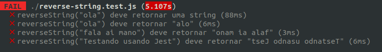
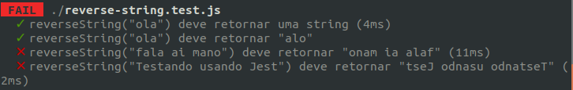
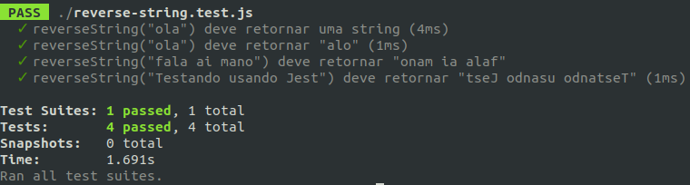

Bom, hoje vamos falar de **testes**, como você garante que aquela função que você escreveu, não parou de funcionar depois de uma atualização ein!? aposto que testar manualmente uma por uma não seja o melhor caminho não é?

É ai que entra o [Jest](https://jestjs.io/), segundo o proprio site:
> O Jest é um delicioso framework de testes em Javascript, com foco na simplicidade

Mas será que isso mesmo?

## Vamos para instalação
Para instalar o Jest basta abrir seu terminal e digitar o seguinte comando:
```shel
$ npm install --save-dev jest-cli
```

## Configuração
>O Jest tem como objetivo trabalhar fora da caixa, sem configurações, na maioria dos projetos JavaScript.

É manolo, basicamente o Jest não precisa de configuração, ele trabalha com o conceito de convenção, mas como assim!? já vou explicar ... assim que você executa seus testes com o Jest, o Jest vai procurar por um diretório chamado: **__tests**__, irá tambem procurar por arquivos: **\*.test.js** ou **\*.spec.js**

## Um pouco de código

Depois de feita a instalação do Jest, vamos adicionar no arquivo **package.json** o **script test**

```js
{
  "scripts": {
    "test": "jest"
  }
}
```

E vamos criar dois arquivos:
```js
'use strict'
//reverseString.js

const reverseString = str => {}

module.exports = reverString
```

```js
'use strict'
//reverseString.test.js

const reverseString = require('./reverseString')

it('reverseString("ola") deve retornar uma string', () => {
    expect(typeof reverseString('ola')).toBe('string')
})

it('reverseString("ola") deve retornar "alo"', () => {
    expect(reverseString('ola')).toBe('alo')
})

it('reverseString("fala ai mano") deve retornar "onam ia alaf"', () => {
    expect(reverseString('fala ai mano')).toBe('onam ia alaf')
})

it('reverseString("Testando usando Jest") deve retornar "tseJ odnasu odnatseT"', () => {
    expect(reverseString('Testando usando Jest')).toBe('tseJ odnasu odnatseT')
})

```
No arquivo **reversString.test.js** utilizamos a a função it(string, func), é uma fucção global do Jest, o primeiro parâmetro é título do seu teste e o segundo parâmetro é uma função.

Abra o terminal e execute:
```
$ npm test
```


Vejam que todos os nossos testes estão falhando, vamos fazer os dois primeiros testes passarem, para isso vamos alterar nosso arquivo reverse-string.js:

```js
'use strict'
//reverseString.js

const reverseString = str => 'alo'

module.exports = reverString
```

vamos executar novamente o
```
$ npm test
```



A nossa alteração no arquivo **reverseString.js** fez passar os dois primeiros testes, mas é obvio que apenas retornar uma string "alo" da nossa função, não atende o que precisamos, mas esse exemplo é apenas para entender o conceito de teste, programando em **baby steps** fazendo seus testes passarem um a um.

Bom, vamos fazer passar todos os nossos teste alterando o arquivo reverseString.js

```js
'use strict'
//reverseString.js

const reverseString = str => str.split('').reverse().join('')

module.exports = reverString
```

E tá lá


Pra quem ainda não testa os códigos em javascript ta ai, um jeito bem facil e rapido de testar a menor parte do seu código,e ai?! caso tenha alguma dúvida não esqueçam de comentar, o feedback é bem importante, até a próxima
